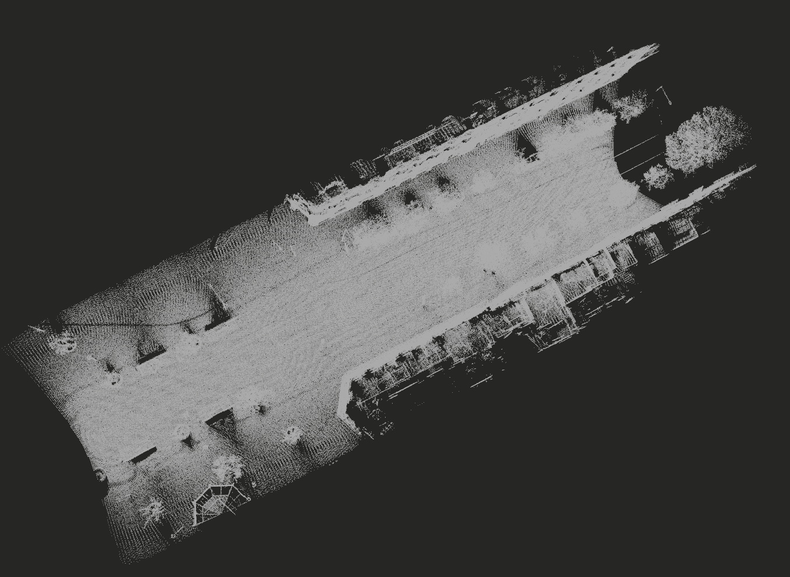
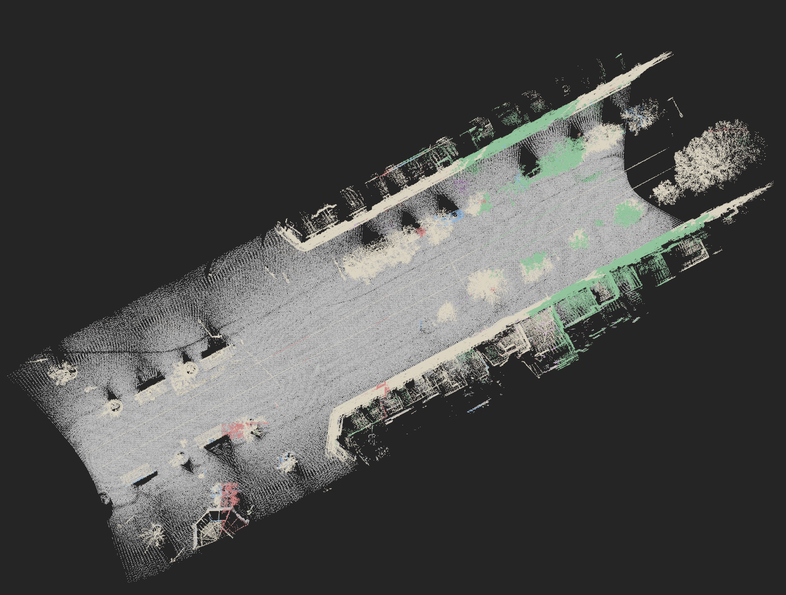

# 3D Point Cloud Semantic Segmentation (NPM3D Mini Benchmark)

<table>
  <tr>
    <td align="center" width="50%">
      
      <br />
      <sub><b>Figure A - Test Point Cloud</b><br />Raw LiDAR geometry before semantic inference.</sub>
    </td>
    <td align="center" width="50%">
      
      <br />
      <sub><b>Figure B - Semantic Prediction</b><br />Point-wise class prediction rendered with class colors.</sub>
    </td>
  </tr>
</table>

**Legend**
- `Figure A`: raw test point cloud before semantic segmentation.
- `Figure B`: semantic segmentation prediction rendered with class colors.

A professional 3D perception project focused on semantic segmentation of urban LiDAR point clouds, with two complementary pipelines:
- a high-performance machine learning baseline (`XGBoost`)
- a deep learning approach inspired by `RandLA-Net`

The objective is to classify each point in the test cloud into one of 6 semantic classes and export clean prediction labels.

## Project Snapshot

| Item | Details |
| --- | --- |
| Domain | 3D Point Cloud Semantic Segmentation |
| Dataset Family | Paris-Lille-3D (mini benchmark subset) |
| Core Pipelines | `train_best.py` (ML), `randlanet_pipeline.ipynb` (DL) |
| Input Data | `.ply` point clouds (`x, y, z`) |
| Output | Per-point semantic labels + optional colorized visualization |

## Dataset Context

The Paris-Lille-3D project is both a dataset and a benchmark for point cloud classification.
Data was produced by a Mobile Laser System (MLS) in Paris and Lille.

The original point cloud was manually labeled with 50 classes to support research on automatic point cloud segmentation and classification.
The mini benchmark subset used in this repository exposes 6 evaluation classes (see `README.txt` for local dataset notes).

Reference paper:
- Roynard X., Deschaud J.-E., Goulette F., *Paris-Lille-3D: a large and high-quality ground truth urban point cloud dataset for automatic segmentation and classification*.

BibTeX citation:

```bibtex
@article{roynard2017parislille3d,
  author = {Xavier Roynard and Jean-Emmanuel Deschaud and François Goulette},
  title = {Paris-Lille-3D: A large and high-quality ground-truth urban point cloud dataset for automatic segmentation and classification},
  journal = {The International Journal of Robotics Research},
  volume = {37},
  number = {6},
  pages = {545-557},
  year = {2018},
  doi = {10.1177/0278364918767506}
}
```

License:
- Paris-Lille-3D is distributed under **CC-BY-NC-ND-3.0** (Creative Commons Attribution Non-Commercial No Derivatives).

## Highlights

- End-to-end workflow from raw `.ply` point clouds to semantic label predictions
- Full-dataset training (`MiniLille1`, `MiniLille2`, `MiniParis1`)
- Strong feature engineering baseline with ensemble modeling
- Deep model notebook for RandLA-Net style training and inference
- Inference pipeline that preserves original test point ordering

## Data Layout

- **Training**: `training/*.ply` with fields `x, y, z, class`
- **Test**: `test/MiniDijon9.ply` with fields `x, y, z`
- **Classes (`1..6`)**: ground, building, poles, pedestrians, cars, vegetation

## Repository Structure

- `xgboost.py`: initial XGBoost baseline pipeline
- `train_best.py`: improved full-data XGBoost ensemble pipeline
- `randlanet_pipeline.ipynb`: RandLA-Net style deep learning pipeline (train + predict)
- `colorize_ply_from_submission.py`: utility to colorize predicted labels for visualization
- `README.txt`: original benchmark mini-challenge notes
- `training/`, `test/`: benchmark point clouds
- `images/`: README visuals and qualitative outputs

## Technical Approach

### 1) ML Pipeline (`XGBoost`)

Implemented in `train_best.py`:
- multi-scale geometric feature extraction from raw XYZ
- local height and density statistics at multiple XY grid scales
- class-balanced weighting for rare classes
- ensemble of tuned XGBoost models with GPU-first fallback to CPU
- chunked inference for memory-safe prediction on full test cloud

### 2) DL Pipeline (RandLA-Net Style)

Implemented in `randlanet_pipeline.ipynb`:
- point chunking/tiling over full scenes
- data augmentation for robust generalization
- local feature aggregation + random downsampling/upsampling blocks
- stage-1 validation training + stage-2 full-data fine-tuning
- test-time voting accumulation with label export

## Quick Start

### Environment

```bash
python -m venv .venv
source .venv/bin/activate
pip install numpy scipy scikit-learn xgboost plyfile open3d tqdm matplotlib pandas
```

### Run the best ML pipeline

```bash
.venv/bin/python train_best.py
```

### Run the DL notebook pipeline

```bash
jupyter notebook randlanet_pipeline.ipynb
```

## Why This Project Matters

This project demonstrates practical ML engineering for 3D data:
- handling large-scale point clouds efficiently
- designing robust feature pipelines and deep models
- balancing experimentation speed with reproducible deployment
- producing interpretable, visualizable semantic outputs for real scenes

It highlights applied data science and 3D perception capabilities relevant to robotics, mapping, autonomous systems, and geospatial AI.
